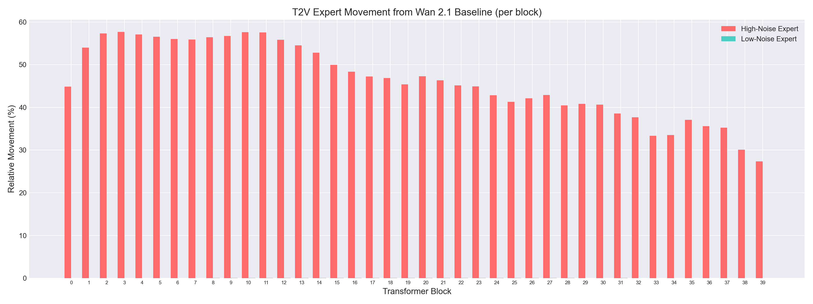
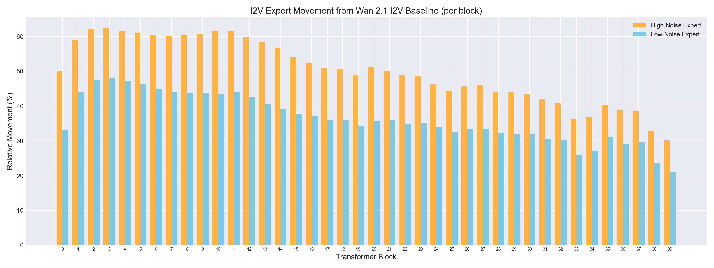
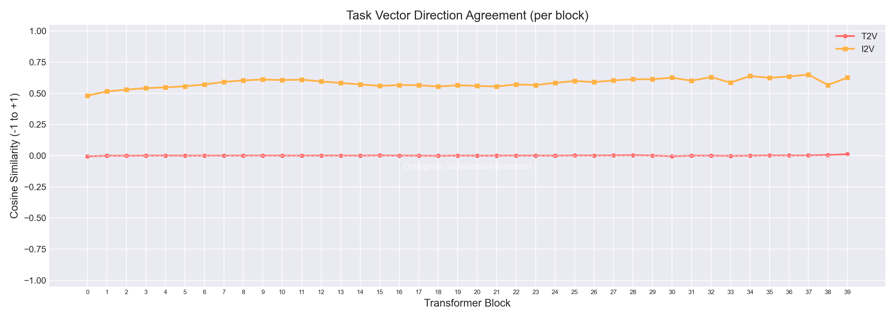
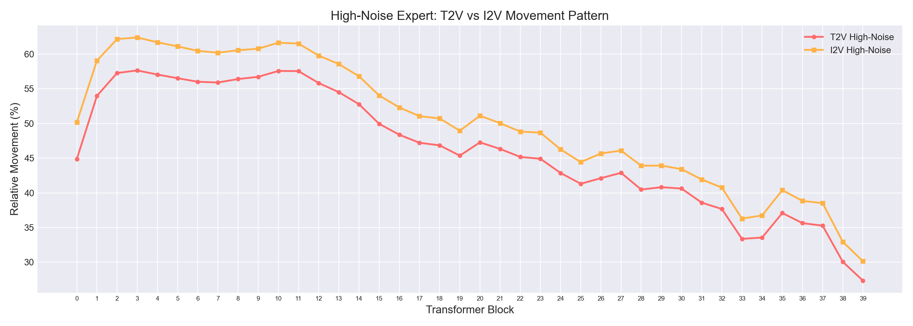
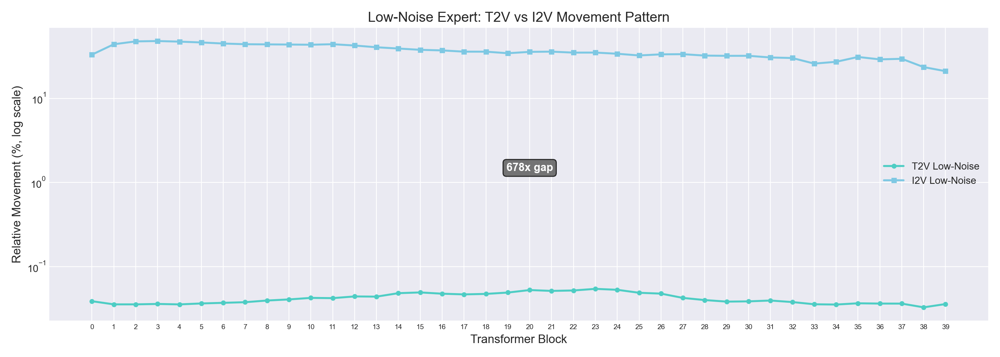
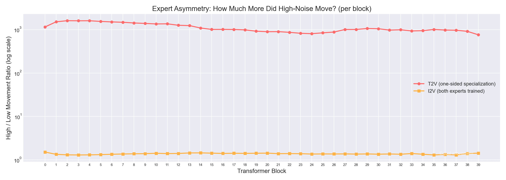
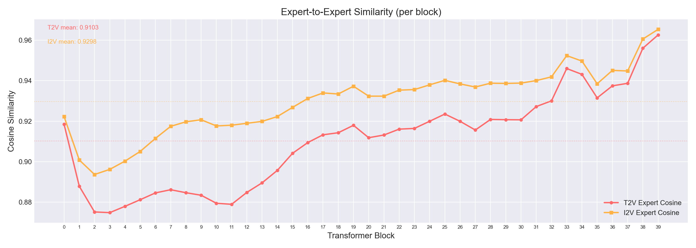
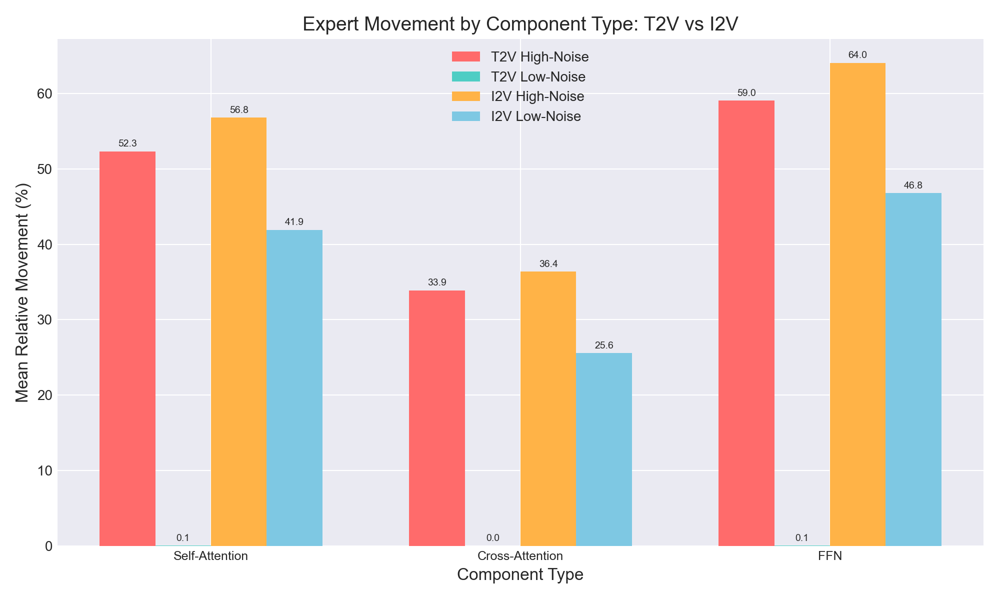

# Wan 2.2 Expert Weight Analysis: Complete Report

**Date:** 2026-02-24
**Authors:** Minta (Alvdansen Labs) & Lykta (Claude)
**Models analyzed:** Wan 2.1 T2V 14B, Wan 2.1 I2V 14B, Wan 2.2 T2V A14B (both experts), Wan 2.2 I2V A14B (both experts)

---

## Table of Contents

1. [What We Were Trying to Learn](#1-what-we-were-trying-to-learn)
2. [The Models Under the Microscope](#2-the-models-under-the-microscope)
3. [How the Analysis Works](#3-how-the-analysis-works)
4. [Test 1: T2V Expert Divergence](#4-test-1-t2v-expert-divergence-wan-21-t2v--wan-22-t2v)
5. [Test 2: I2V Expert Divergence](#5-test-2-i2v-expert-divergence-wan-21-i2v--wan-22-i2v)
6. [Test 3: T2V vs I2V Cross-Comparison](#6-test-3-t2v-vs-i2v-cross-comparison)
7. [The Complete Picture](#7-the-complete-picture)
8. [What This Means for LoRA Training](#8-what-this-means-for-lora-training)

---

## 1. What We Were Trying to Learn

Wan 2.2 uses a **dual Mixture-of-Experts (MoE)** architecture. Instead of one transformer, it has two: a **high-noise expert** that handles early denoising (global composition, motion planning) and a **low-noise expert** that handles late denoising (fine details, textures). The model routes between them based on the signal-to-noise ratio of the current timestep.

Both experts started from the same Wan 2.1 pretrained weights. Alibaba then specialized them during the 2.1 → 2.2 upgrade. Our questions:

- **How much did each expert change** from the Wan 2.1 base?
- **Did they change in the same direction** (shared improvement) or **different directions** (true specialization)?
- **Which layers changed the most** — and are those the layers we should target with LoRA?
- **Is the pattern the same for T2V and I2V**, or does image conditioning change things?

Answering these questions directly informs how we design differential MoE training in Dimljus.

---

## 2. The Models Under the Microscope

We analyzed six sets of transformer weights across four model variants:

| Model | Path | Role | Parameters |
|-------|------|------|------------|
| Wan 2.1 T2V 14B | `Wan2.1-T2V-14B-Diffusers/transformer/` | T2V baseline | ~14B |
| Wan 2.2 T2V A14B Expert 1 | `Wan2.2-T2V-A14B-Diffusers/transformer/` | T2V high-noise expert | ~14B |
| Wan 2.2 T2V A14B Expert 2 | `Wan2.2-T2V-A14B-Diffusers/transformer_2/` | T2V low-noise expert | ~14B |
| Wan 2.1 I2V 14B | `Wan2.1-I2V-14B-720P-Diffusers/transformer/` | I2V baseline | ~14B |
| Wan 2.2 I2V A14B Expert 1 | `Wan2.2-I2V-A14B-Diffusers/transformer/` | I2V high-noise expert | ~14B |
| Wan 2.2 I2V A14B Expert 2 | `Wan2.2-I2V-A14B-Diffusers/transformer_2/` | I2V low-noise expert | ~14B |

Each transformer has **40 blocks** (blocks 0–39), with each block containing:
- **Self-attention** (attn1): Q, K, V, output projections
- **Cross-attention** (attn2): Q, K, V, output projections (text conditioning)
- **FFN**: up-projection and down-projection
- **Norms**: layer norms, QK norms
- **Modulation**: scale/shift tables (adaLN)

Plus global layers outside the blocks (embeddings, output head).

Each model has **1,095 total layers**. Of these, **400 are LoRA targets** (attention projection weights + FFN weights) — these are the layers we'd actually attach LoRA adapters to during training, and the ones we care about most.

---

## 3. How the Analysis Works

### The Tool: Task Vector Analysis

The analysis scripts (`scripts/task_vector_analysis.py` for T2V, `scripts/task_vector_analysis_i2v.py` for I2V) use a technique called **task vector analysis**. The idea is simple:

> If you subtract a model's original weights from its fine-tuned weights, the difference vector (the "task vector") tells you exactly what changed, how much, and in what direction.

### Step-by-Step Process

**Step 1: Load weights layer by layer.**

Each model's weights are stored in safetensors shard files (~4–8 GB each, multiple shards per model). We use **lazy loading** — for each layer, we load only that specific tensor from disk, not the entire shard. This keeps memory manageable despite processing ~80 GB of weights total.

```python
with safe_open(shard_path, framework="pt", device="cpu") as f:
    tensor = f.get_tensor(layer_name)
```

All tensors are converted to float32 for consistent computation (the models store weights in bfloat16).

**Step 2: Compute task vectors.**

For each layer that exists in all three models (base + both experts), we compute:

```
task_vector_high = high_noise_expert_weights - base_weights
task_vector_low  = low_noise_expert_weights  - base_weights
```

These task vectors capture *exactly what changed* during the 2.1 → 2.2 specialization.

**Step 3: Measure four things per layer.**

For each layer, we compute:

| Metric | What It Measures | Formula |
|--------|-----------------|---------|
| **Relative magnitude** | How far the expert moved from base, as a percentage of the base weight magnitude | `‖task_vector‖ / ‖base_weights‖ × 100` |
| **Task vector cosine** | Whether the two experts moved in the same direction (-1 = opposite, 0 = orthogonal/independent, +1 = identical direction) | `cos(task_vector_high, task_vector_low)` |
| **Expert cosine** | How similar the two experts are to each other (1.0 = identical) | `cos(high_expert, low_expert)` |
| **Base cosine** | How similar each expert is to the original base model | `cos(expert, base)` |

**Step 4: Aggregate and analyze.**

We group results by:
- **Block number** (0–39) to see the spatial gradient through the transformer
- **Component type** (self-attention, cross-attention, FFN) to see which parts specialized
- **LoRA target vs non-target** to focus on actionable layers

### What Runs Where

The entire analysis runs on **CPU only** — no GPU needed. It processes ~80 GB of model weights across the three models, loading one layer at a time. Runtime is a few minutes per model trio. Results are saved to JSON for reproducibility.

### The Comparison Script

A third script (`scripts/compare_task_vectors.py`) reads both JSON result files and computes cross-model correlations:
- Pearson correlation between T2V and I2V metrics at both layer and block level
- Spearman rank correlation for block ordering
- Quartile overlap analysis for training strategy alignment

---

## 4. Test 1: T2V Expert Divergence (Wan 2.1 T2V → Wan 2.2 T2V)

This was the first analysis we ran. Baseline: Wan 2.1 T2V. Experts: Wan 2.2 T2V high-noise and low-noise.

### The Headline Finding: One-Sided Specialization



The chart tells the whole story. The coral bars (high-noise expert) moved significantly from Wan 2.1 — averaging **46.3%** relative magnitude across LoRA targets. The teal bars (low-noise expert) are essentially invisible at this scale — averaging **0.04%**.

**The low-noise expert IS Wan 2.1.** It barely changed at all.

### Key Numbers (T2V, LoRA targets only)

| Metric | High-Noise Expert | Low-Noise Expert |
|--------|-------------------|------------------|
| Average movement from 2.1 | 46.30% | 0.04% |
| Asymmetry ratio | 1,100x more than low | — |
| Task vector cosine | ~0.0 (orthogonal) | — |
| Expert-to-expert cosine | 0.9103 (mean across blocks) | — |

### Movement Gradient: Early Blocks Changed Most

| Block Range | High-Noise Movement | Low-Noise Movement |
|-------------|--------------------|--------------------|
| Early (0–9) | 55.2% | 0.04% |
| Middle (10–29) | 47.5% | 0.05% |
| Late (30–39) | 34.9% | 0.04% |

Early blocks handle high-level composition and motion planning — exactly what the high-noise expert needs to do differently. Late blocks handle fine details, and the high-noise expert changed less there (it hands off to the low-noise expert for those).

### Component Breakdown (T2V)

| Component | High-Noise Movement | Low-Noise Movement |
|-----------|--------------------|--------------------|
| Self-attention | 52.3% | 0.05% |
| Cross-attention | 33.9% | 0.02% |
| FFN | 59.0% | 0.06% |

FFN layers changed the most, cross-attention the least. This makes intuitive sense: FFN layers store learned features, while cross-attention mediates text conditioning (which both experts still need to handle similarly).

### Task Vector Direction: Completely Independent

The task vector cosine between the two experts averages **0.0005** — effectively zero. This means:

- The high-noise expert's changes are **orthogonal** to the low-noise expert's changes
- They moved in completely independent directions in weight space
- There is no shared "improvement direction" — the specialization was a pure fork

### What This Told Us

Alibaba's process was essentially: take Wan 2.1, copy it to create two experts, retrain the high-noise expert heavily, leave the low-noise expert essentially untouched. The specialization was **one-sided**.

For LoRA training, this means:
- Training the low-noise expert conservatively makes sense — it's already doing what it needs to do
- The high-noise expert is where the action is — it needs to learn new composition/motion patterns
- A "unified warmup then fork for high-noise only" strategy is well-justified

---

## 5. Test 2: I2V Expert Divergence (Wan 2.1 I2V → Wan 2.2 I2V)

Same methodology, different models. Baseline: Wan 2.1 I2V. Experts: Wan 2.2 I2V high-noise and low-noise.

### The Headline Finding: Two-Sided Specialization



Compare this to the T2V chart above. **Both experts moved significantly.** The orange bars (high-noise) average 50.1%, and the blue bars (low-noise) average **36.4%**. The low-noise expert is NOT Wan 2.1 I2V — it changed dramatically.

### Key Numbers (I2V, LoRA targets only)

| Metric | High-Noise Expert | Low-Noise Expert |
|--------|-------------------|------------------|
| Average movement from 2.1 I2V | 50.1% | 36.4% |
| Asymmetry ratio | 1.4x (nearly equal) | — |
| Task vector cosine | 0.58 (same direction!) | — |
| Expert-to-expert cosine | 0.9298 (mean across blocks) | — |

### The Massive Difference: Low-Noise Movement

| Metric | T2V Low-Noise | I2V Low-Noise | Ratio |
|--------|---------------|---------------|-------|
| Average movement | 0.04% | 36.4% | **~900x** |
| Layers under 5% movement | 258/400 (65%) | 0/400 (0%) | — |
| Layers under 1% movement | 14/400 | 0/400 | — |

Not a single LoRA-target layer in the I2V low-noise expert moved less than 5% from base. Every layer changed substantially.

### Movement Gradient: Same Pattern, Higher Baseline

| Block Range | High-Noise Movement | Low-Noise Movement |
|-------------|--------------------|--------------------|
| Early (0–9) | 59.9% | 44.3% |
| Middle (10–29) | 51.2% | 36.5% |
| Late (30–39) | 38.0% | 28.1% |

The same early > middle > late gradient exists, but now it applies to **both** experts.

### Component Breakdown (I2V)

| Component | High-Noise Movement | Low-Noise Movement |
|-----------|--------------------|--------------------|
| Self-attention | 56.8% | 41.9% |
| Cross-attention | 36.4% | 25.6% |
| FFN | 64.0% | 46.8% |

Same ordering as T2V (FFN > self-attn > cross-attn), but with the low-noise expert showing massive movement across all components.

### Task Vector Direction: Coordinated Movement

The task vector cosine is **0.58** — the two experts moved in **similar directions**. This is a fundamentally different pattern from T2V's orthogonal (0.0) specialization.



The I2V line (orange) sits consistently around 0.5–0.65 across all blocks, while T2V (coral) sits flat at zero. The I2V experts didn't just both move a lot — they moved **in the same general direction**.

---

## 6. Test 3: T2V vs I2V Cross-Comparison

With both analyses complete, we can compare the specialization patterns across model types.

### High-Noise Experts: Nearly Identical Pattern



The high-noise experts followed almost exactly the same movement pattern in T2V and I2V:
- **Pearson correlation: 0.9992** (near-perfect)
- Same blocks moved most (2, 3, 4, 5, 6, 7, 8, 9, 10, 11)
- Same blocks moved least (33, 34, 37, 38, 39)
- I2V high-noise moved slightly more overall (50.1% vs 46.3%)

The high-noise expert does the same job in both model types — handle global composition and motion at high noise levels — so this makes sense.

### Low-Noise Experts: Completely Different Story



This is the most important chart in the entire analysis. Note the **log scale** — the two lines are separated by a factor of ~678x. T2V low-noise barely moved (0.04%), I2V low-noise moved massively (36.4%).

The correlation between T2V and I2V low-noise patterns is moderate (Pearson r = 0.71). The block-level *pattern* is somewhat similar (both have early > late gradient), but the *magnitudes* are in completely different universes.

### Expert Asymmetry: The Defining Difference



This chart shows the ratio of high-noise movement to low-noise movement per block, on a log scale:
- **T2V**: ratio ~1,000x — one expert did all the changing
- **I2V**: ratio ~1.3–1.5x — both experts changed roughly equally

The dashed line at 1.0 represents perfectly equal movement. I2V hugs this line. T2V is three orders of magnitude above it.

### Expert-to-Expert Similarity



Both T2V and I2V show the same general pattern: early blocks are more diverged (lower cosine), late blocks are more similar (higher cosine). The means are:
- **T2V**: 0.9103
- **I2V**: 0.9298

I2V experts are actually *more similar to each other* than T2V experts, despite both having moved more from their baseline. This aligns with the coordinated movement finding (TV cosine 0.58).

### Component-Level Comparison



This chart shows the full picture for all three component types:
- High-noise movement is similar between T2V and I2V (coral vs orange bars)
- Low-noise movement is the discriminator: T2V teal bars are essentially zero, I2V blue bars are substantial

The low-noise I2V expert changed most in FFN (46.8%), followed by self-attention (41.9%), then cross-attention (25.6%).

### Block Specialization Ranking: Identical

Despite all these differences, the *ranking* of which blocks specialized most vs least is virtually identical between T2V and I2V:

- **Spearman rank correlation: 0.9959**
- **Top quartile overlap: 10/10** (blocks 2–11 in both)
- **Bottom quartile overlap: 9/10** (blocks 30–39 in both, differing only on block 28 vs 30)

The transformer has the same spatial structure of "important early blocks / less important late blocks" regardless of model type.

### Cross-Model Correlations (Layer-Level)

| Metric | Pearson r | Interpretation |
|--------|-----------|----------------|
| High-noise magnitude | 0.9992 | Near-identical patterns |
| Low-noise magnitude | 0.7093 | Moderately correlated (same ranking, different magnitudes) |
| Task vector cosine | 0.2840 | Weakly correlated |
| Expert cosine | 0.9745 | Strongly correlated |

---

## 7. The Complete Picture

### Summary Table

| | T2V | I2V |
|---|---|---|
| **High-noise movement** | 46.3% | 50.1% |
| **Low-noise movement** | 0.04% | 36.4% |
| **Asymmetry (H/L ratio)** | 1,100x | 1.4x |
| **TV cosine (direction)** | 0.0005 (orthogonal) | 0.58 (similar) |
| **Expert cosine** | 0.9103 | 0.9298 |
| **Specialization type** | One-sided | Two-sided, coordinated |

### Why I2V Is Different: The Image Conditioning Channel

The fundamental difference between T2V and I2V is how conditioning information enters the model:

- **T2V**: Text goes through the T5 encoder and enters via **cross-attention**. The noisy latent input has 16 channels (pure noise → video).

- **I2V**: Same text pathway, but the reference image is **VAE-encoded and concatenated directly with the noisy latents** — the input has 36 channels (16 noise + 20 image conditioning). The image signal is *baked into every layer's input*.

This is why the I2V low-noise expert couldn't stay as Wan 2.1. In T2V, the low-noise expert only processes noise + text cross-attention — and its 2.1 weights already knew how to do that. But in I2V, every layer processes noise **plus image conditioning channels**. The low-noise expert needed to learn how to use that image information for its specific job (fine detail rendering), which requires changing its weights.

Both experts had to adapt to the image conditioning, and they adapted in **similar directions** (cosine 0.58) because they're both learning the same fundamental skill: "use this reference image." The difference is in *how* they use it — high-noise for composition, low-noise for detail fidelity.

### The Training Story Alibaba Told (Reconstructed)

Based on this data, we can reconstruct what Alibaba likely did:

**For T2V (2.1 → 2.2):**
1. Copied Wan 2.1 T2V weights to create two experts
2. Heavily retrained the high-noise expert with timestep-restricted training (SNR > boundary)
3. Left the low-noise expert essentially untouched — it already handled fine detail well
4. Result: one expert that's good at composition/motion (new), one that's good at details (inherited)

**For I2V (2.1 → 2.2):**
1. Copied Wan 2.1 I2V weights to create two experts
2. Retrained **both** experts — the image conditioning channel demanded adaptation from both
3. The high-noise expert adapted slightly more (50% vs 36%), consistent with needing to learn composition from reference images
4. Both moved in similar directions because both are learning "how to use the reference image"
5. Result: two experts that both understand image conditioning, but emphasize different aspects of it

---

## 8. What This Means for LoRA Training

### T2V LoRA Strategy: Differential Per-Expert Training

The one-sided pattern confirms the existing hypothesis:

- **High-noise expert**: Needs aggressive training (higher rank, higher learning rate). This expert carries the compositional/motion adaptation burden.
- **Low-noise expert**: Needs conservative training (lower rank, lower learning rate). It's already well-calibrated for detail work.
- **Per-expert hyperparameters are essential** — the task vector cosine of ~0 means the experts want completely different things.
- **Fork-and-specialize**: Train a shared LoRA warmup targeting blocks 2–11 (most specialized), then fork for per-expert tuning.

Current experimental parameters (from Minta's production experience):
- High-noise: rank 16 / lr 1e-4 / 30 epochs
- Low-noise: rank 24 / lr 8e-5 / 50 epochs

### I2V LoRA Strategy: Unified or Lightly Differential

The two-sided, coordinated pattern suggests a different approach:

- **Unified LoRA may work well** — the task vector cosine of 0.58 means both experts are moving in similar directions. A single LoRA applied to both could capture a meaningful fraction of the desired adaptation.
- **If using per-expert training**, both experts need real training budgets — you can't skip the low-noise expert like you can in T2V.
- **The asymmetry ratio (1.4x)** suggests only slightly different hyperparameters between experts, not the 10x+ differences needed for T2V.

### Block Targeting (Both Models)

The block-level ranking is the same for both T2V and I2V, which simplifies targeting:

- **Priority blocks** (most adaptation needed): 2, 3, 4, 5, 6, 7, 8, 9, 10, 11
- **Secondary blocks** (moderate adaptation): 12–29
- **Low-priority blocks** (least adaptation): 30–39

This means a "top-N blocks" targeting strategy works identically for both model types.

### Component Targeting (Both Models)

Within each block:
- **FFN** changed most → highest training priority
- **Self-attention** changed moderately → standard LoRA target
- **Cross-attention** changed least → can use lower rank or exclude for efficiency

### Implications for Dimljus Phase 5 (Training Config Schema)

The training config must support:

1. **Per-expert hyperparameters** (rank, learning rate, epochs) — essential for T2V
2. **Unified mode** (single LoRA, both experts) — valid for I2V
3. **Model-type-aware defaults** — T2V defaults should be highly asymmetric, I2V defaults should be nearly symmetric
4. **Block-level targeting** — ability to specify which blocks get LoRA adapters, or different ranks per block range
5. **Component-level targeting** — ability to configure different ranks for FFN vs attention layers

---

## Appendix: Reproduction

### Scripts

| Script | Purpose |
|--------|---------|
| `scripts/task_vector_analysis.py` | T2V analysis (Wan 2.1 T2V → 2.2 T2V experts) |
| `scripts/task_vector_analysis_i2v.py` | I2V analysis (Wan 2.1 I2V → 2.2 I2V experts) |
| `scripts/compare_task_vectors.py` | Cross-model comparison |
| `scripts/generate_report_charts.py` | Chart generation |

### Raw Data

| File | Contents |
|------|----------|
| `scripts/task_vector_results.json` | Per-layer metrics for all 1,095 T2V layers |
| `scripts/task_vector_results_i2v.json` | Per-layer metrics for all 1,095 I2V layers |

### Requirements

- Python 3.10+
- PyTorch (CPU only)
- safetensors
- matplotlib (for charts only)
- ~80 GB disk space for model weights (6 transformer directories)

### Running

```bash
# T2V analysis (edit paths in script first)
python scripts/task_vector_analysis.py

# I2V analysis
python scripts/task_vector_analysis_i2v.py

# Cross-comparison
python scripts/compare_task_vectors.py

# Generate charts
python scripts/generate_report_charts.py
```
